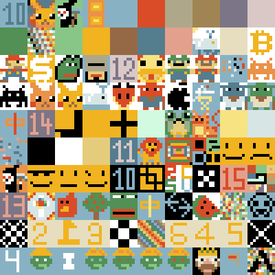
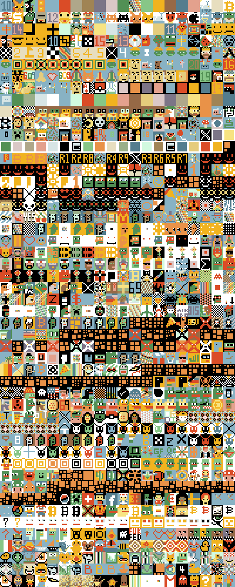

# Bixel  - Bitcoin Ordinal Inscription Pixel (Image) Protocol


## V1 / Chapter 1 / OG   - 7x7 canvas / 10 colors

- 7x7 canvas (=49 pixels)
- 10 colors (0-9)
  - 0 => #434a41, 1 => #689579, 2 => #cdd995, 3 => #e7debf, 
    4 => #e5cc7c, 5 => #f1b31f, 6 => #e99248, 7 => #da4c27, 
    8 => #dac8c6, 9 => #547d8e
  

Example - .bixel no. 10 (at inscribe no. 21964036)

```
3113113111111311303011111111117777711111131111333.bixel 
```


Let's use the pixelart machinery to generate the (bitmap) image 
from the paint by number spec.


``` ruby
require 'pixelart'

## step 1 - define the paint by number color mapping
COLORS = {
        '0': '#434a41', 
        '1': '#689579', 
        '2': '#cdd995', 
        '3': '#e7debf', 
        '4': '#e5cc7c', 
        '5': '#f1b31f', 
        '6': '#e99248', 
        '7': '#da4c27', 
        '8': '#dac8c6', 
        '9': '#547d8e'
}  

## step 2 - generate the bitmap image / parse the spec
img = Image.parse( '3113113111111311303011111111117777711111131111333'
                   colors: COLORS,
                   width: 7, 
                   height: 7 ) 
img.save( "./bixel10.png" )
img.zoom(8).save( "./bixel10@8x.png" )
```

Voila!


in 8x


Bonus:  Let's define a ready-to-use Bixel Image class.

```ruby
module Bixel
  # 7x7 canvas (49 pixels) -  10 colors (0-9)
  WIDTH  = 7
  HEIGHT = 7      
  COLORS = {
        '0': '#434a41', 
        '1': '#689579', 
        '2': '#cdd995', 
        '3': '#e7debf', 
        '4': '#e5cc7c', 
        '5': '#f1b31f', 
        '6': '#e99248', 
        '7': '#da4c27', 
        '8': '#dac8c6', 
        '9': '#547d8e'
  }    
  class Image < Pixelart::Image
     def self.parse( pixels )
        super( pixels, colors: COLORS, 
                       width:  WIDTH,
                       height: HEIGHT)
     end
  end # class Image
end # module Bixel
```


and let's retry:

``` ruby
img = Bixel::Image.parse( '3113113111111311303011111111117777711111131111333' ) 
img.save( "./bixel10.png" )
img.zoom(8).save( "./bixel10@8x.png" )
```

Voila!


in 8x


Let's try some more.
[Search for .bixel](https://unisat.io/search?q=bixel&type=text) via unisat.


```ruby
bixels = [
  # Bixel #32 - Inscription #22140448
  [32,'0060000066660000600600066600006006006666000060000'],
  # Bixel #43 - Inscription #22140536
  [43,'0055500055555055050555555555550005606555600066600'],
  # Bixel #50 - Inscription #22140557
  [50,'9994999984548994575499845489988488998818899991999'],
  # Bixel #86 - Inscription #22141494
  [86,'8899988889998899999998888888889898888878888999998'],
  # Bixel #90 - Inscription #22141738
  [90,'0000000000100000110000001000000100000111000000000'],
  # Bixel #153 - Inscription #22159765
  [153,'0777777077777707777770777777077777707700000770000'],
  # Bixel #163 - Inscription #22159775
  [163,'3795793951116551010177117119311111333101333311133'],
  # Bixel #298 - Inscription #22160168
  [298,'0000000077077007070700700070007070000070000000000'],
  # Bixel #405 - Inscription #22160379
  [405,'7777777777777775777575757575577577557777755777775'],
  # Bixel #432 - Inscription #22160466
  [432,'0033300033333030030033003003333033303333300030300'],
]

bixels.each do |num,spec|
  img = Bixel::Image.parse( spec ) 
  img.save( "./bixel#{num}.png" )
  img.zoom(8).save( "./bixel#{num}@8x.png" )
end
```

resulting in:


in 8x


## V2 / Chapter 2   - 10x10 canvas / 21 colors

- 10x10 canvas (=100 pixels)
- 21 colors (A-U)
  - A => #88b2c4, B => #547d8e, C => #dac8c6, D => #7c7587,
    E => #e3a18d, F => #da4c27, G => #f1b31f, H => #e99248,
    I => #87c687, J => #529055, K => #a08454, L => #966946,
    M => #e7debf, N => #afa78a, O => #d2fae0, P => #f7e382,
    Q => #9aaf89, R => #e5cc7c, S => #fff,    T => #d7e5e5,
    U => #000


Example - .biixel (at inscribe no. 22237694)

```
UGGLBBBBBLUHGHLBBBLHBLHGHLBBHGBBLHGGGGGHBBLGGGGGGGDDHSUGGGSUDGHUUGGGUUDFFGGGLGGGDFFHGLHLGHDDLHHHHHHH.biixel 
```


Let's use the pixelart machinery to generate the (bitmap) image 
from the paint by letter spec.

Step 1 - let's define a read-to-use Biixel Image class:

``` ruby
module Biixel    
  # 10x10 canvas (100 pixels) - 21 colors (A-U)
  WIDTH  = 10
  HEIGHT = 10
  COLORS = {
    A: '#88b2c4',
    B: '#547d8e',
    C: '#dac8c6', 
    D: '#7c7587',
    E: '#e3a18d', 
    F: '#da4c27',
    G: '#f1b31f',
    H: '#e99248',
    I: '#87c687', 
    J: '#529055',
    K: '#a08454', 
    L: '#966946',
    M: '#e7debf', 
    N: '#afa78a',
    O: '#d2fae0', 
    P: '#f7e382',
    Q: '#9aaf89', 
    R: '#e5cc7c',
    S: '#fff',
    T: '#d7e5e5',
    U: '#000' }

  class Image < Pixelart::Image
    def self.parse( pixels )
      super( pixels, colors: COLORS, 
                     width:  WIDTH,
                     height: HEIGHT)
    end
  end # class Image
end  # module Biixel
```


and step 2 - let's generate the bitmap image / parse the spec:

```ruby
img = Biixel::Image.parse( 'UGGLBBBBBLUHGHLBBBLHBLHGHLBBHGBBLHGGGGGHBBLGGGGGGGDDHSUGGGSUDGHUUGGGUUDFFGGGLGGGDFFHGLHLGHDDLHHHHHHH' )
img.save( "./biixel1.png" )
img.zoom(8).save( "./biixel1@8x.png" )

```

Voila!


in 8x


Let's try some more.
[Search for .biixel](https://unisat.io/search?q=biixel&type=text) via unisat.

Let's prepare an (SQL) database with 1000+ inscriptions
matching the 'biixel' full-text search (on unsisat)
with all inscribed ids listed in [biixel.csv](biixel.csv).

Let's download the inscriptions (metadata & content) 
via ordinals.com to a local cache (in `/inscription`)
and than import into single-file SQLite database (`ord.db`).

``` ruby
require 'ordlite'

cache = Ordinals::Cache.new( './inscription' )
cache.add_csv( './biixel.csv' )

OrdDb.open( './ord.db' )
cache.import_all

puts
puts "  #{Inscribe.count} inscribe(s)"
puts "  #{Blob.count} blob(s)"
#=>  1024 inscribe(s)
#=>  1024 blob(s)
```


Now let's query for the .biixel inscriptions 
and validate the candidates to filter out broken mints
not matching the pattern `[A-U]{100}.biixel`.


``` ruby
require 'ordlite'

OrdDb.open( './ord.db' )

inscribes = Inscribe.joins( :blob )
                   .where( 'content LIKE ?', '%.biixel%' )
                   .order( 'num' )
                   
puts
puts "  #{inscribes.size} inscribe(s) - unconfirmed candidates"


## validate / filter-out false positives
PIIXEL_RX =  /\A
               [A-U]{100}
               \.biixel
               \z/x

inscribes = inscribes.select do |inscribe|
                if PIXXEL_RX.match( inscribe.text.strip )
                    true
                else  
                    puts "!! WARN - expected [A-U]{100}.biixel inscribe no. #{inscribe.num} @ #{inscribe.date}; got:"
                    puts "  >#{inscribe.text}<"
                    false  
                end
             end

puts
puts "  #{inscribes.size} inscribe(s) - validated"
```

resulting in

```
 1023 inscribe(s) - unconfirmed candidates

!! WARN - expected [A-U]{100}.biixel inscribe no. 22238685 @ 2023-08-08 23:38:58 UTC; got:
  >SUSUSUSUSUUSUSUSUSUUUUSUSUSUUUUUUSUSUUUUUUUUSUUUUUUUUUUSUUUUUUUUSUSUUUUUUSUSUSUUUUSUSUSUSUUSUSUSUSUS.biixel
   FUFUFUFUFUUFUFUFUFUUUUFUFUFUUUUUUFUFUUUUUUUUFUUUUUUUUUUFUUUUUUUUFUFUUUUUUFUFUFUUUUFUFUFUFUUFUFUFUFUF.biixel
   GUGUGUGUGUUGUGUGUGUUUUGUGUGUUUUUUGUGUUUUUUUUGUUUUUUUUUUGUUUUUUUUGUGUUUUUUGUGUGUUUUGUGUGUGUUGUGUGUGUG.biixel
   AUAUAUAUAUUAUAUAUAUUUUAUAUAUUUUUUAUAUUUUUUUUAUUUUUUUUUUAUUUUUUUUAUAUUUUUUAUAUAUUUUAUAUAUAUUAUAUAUAUA.biixel
   UAAAAAAAAUAUAAAAAAUAAAUAAAAUAAAAAUAAUAAAAAAAUUAAAAAAAAUUAAAAAAAUAAUAAAAAUAAAAUAAAUAAAAAAUAUAAAAAAAAU.biixel<
!! WARN - expected [A-U]{100}.biixel inscribe no. 22238686 @ 2023-08-08 23:38:58 UTC; got:
  >biixelFAAAAAAAAFAFAAAAAAFAAAFAAAAFAAAAAFAAFAAAAAAAFFAAAAAAAAFFAAAAAAAFAAFAAAAAFAAAAFAAAFAAAAAAFAFAAAAAAAAF.biixel
   AAAAAAAAAAAAAAAAAAAAAAAAAAAAAAGGGGAAAJJAGAAAAAAJAJGAGGFFFJAJGAAGFAFJAJGGGGFFFJJAAAAAAAAAAAAAAAAAAAAA.biixel
   AAAAAAAAAAAAAAAAAAAAAAAAAAAAAAGGGGAAAUUAGAAAAAAUAUGAGGFFFUAUGAAGFAFUAUGGGGFFFUUAAAAAAAAAAAAAAAAAAAAA.biixel<
!! WARN - expected [A-U]{100}.biixel inscribe no. 22238748 @ 2023-08-09 00:32:25 UTC; got:
  >lFDOBCGAHIEDOBCGAHIEIOBCGAHIEIHBCGAHIEIHACGAHIEIHAGGAHIEIHAGCAHIEIHAGCBHIEIHAGCBOIEIHAGCBODEIHAGCBODF.biixel<
!! WARN - expected [A-U]{100}.biixel inscribe no. 22238957 @ 2023-08-09 00:51:29 UTC; got:
  >啊啊啊啊啊啊啊啊啊啊啊啊啊啊啊啊啊啊啊啊啊啊啊啊啊啊啊啊啊啊啊啊啊啊啊啊啊啊啊啊啊啊啊啊啊啊啊啊啊啊啊啊啊啊啊啊啊啊 啊啊啊啊啊啊啊啊啊啊啊啊啊啊啊啊啊啊啊啊啊啊啊啊啊.biixel<
!! WARN - expected [A-U]{100}.biixel inscribe no. 22250952 @ 2023-08-09 03:05:25 UTC; got:
  >SSSSSSSSSSSSJJQJJSSSSSJJJJJJJSSSGGGGGGSSSSGGBGBFFFSSGGGGGGSSSSGFFFFGSSSSGGGGGGSSSSSGGGSSSSSSSGGGSSSS.biixel
   SSSSSSSSSSSSBBABBBSSSBBBBBBBSSSSIIIIIISSSSIIUIUISSSSIIIIIISSSSIFFFFISSSSIIIIIISSSSSIIISSSSSSSIIISSSS.biixel<
!! WARN - expected [A-U]{100}.biixel inscribe no. 22291179 @ 2023-08-09 03:57:53 UTC; got:
  >WXYZWXYZWXYZWXYZWXYZWXYZWXYZWXYZWXYZWXYZWXYZWXYZWXYZWXYZWXYZWXYZWXYZWXYZWXYZWXYZWXYZWXYZWXYZWXYZWXYZ.biixel<
!! WARN - expected [A-U]{100}.biixel inscribe no. 22345638 @ 2023-08-09 08:00:09 UTC; got:
  >ABJILPEFQMNCDGHRSTUOVWKXYTZBCJKLDFAGMQROPHNTSVWUXEIYLZCJDBLKFAPGMQHSORNTVWIUZXJYLCZBCJKLDFAGMQROPARH.biixel<
!! WARN - expected [A-U]{100}.biixel inscribe no. 22348229 @ 2023-08-09 08:21:55 UTC; got:
  >PUSHFORCHANGEADVENTURESBRINGPERSPECTIVESRESISTTHEOLDSTANDFIRMBELIEVEANDEMBRACEBITCOINORDINALS.biixel<
!! WARN - expected [A-U]{100}.biixel inscribe no. 22350766 @ 2023-08-09 08:37:31 UTC; got:
  >FUCKERSINSCHOOLTELLINGMEALWAYSINTHEBARBERSHOPCHIEFKEEFAINTBOUTTHISCHIEFAINTBOUTTHATMYBOYABDONFUCKING.biixel<
!! WARN - expected [A-U]{100}.biixel inscribe no. 22350767 @ 2023-08-09 08:37:31 UTC; got:
  >TRAPPINOUTTHEBANDOoTRAPPINOUTTHEBANDOoTRAPPINOUTTHEBANDOoTRAPPINOUTTHEBANDOoTRAPPINOUTTHEBANDOoTRAPP.biixel<
!! WARN - expected [A-U]{100}.biixel inscribe no. 22350768 @ 2023-08-09 08:37:31 UTC; got:
  >FUCKGARYGENSLERFUCKGARYGENSLERFUCKGARYGENSLERFUCKGARYGENSLERFUCKGARYGENSLERFUCKGARYGENSLERFUCKTHESEC.biixel<
!! WARN - expected [A-U]{100}.biixel inscribe no. 22350786 @ 2023-08-09 08:37:31 UTC; got:
  >THISISTHEPSYOPTHISISTHEPSYOPTHISISTHEPSYOPTHISISTHEPSYOPTHISISTHEPSYOPTHISISTHEPSYOPTHISISTHEPSYOPTH.biixel<
!! WARN - expected [A-U]{100}.biixel inscribe no. 22351383 @ 2023-08-09 09:05:43 UTC; got:
  >LEADTHEWAYINANERAOFCRISISRESISTTHEOLDSTANDFIRMPROMOTECHANGEANDTRUSTEMBRACEBITCOINORDINALSFIGHTBACKGO.biixel<
!! WARN - expected [A-U]{100}.biixel inscribe no. 22395842 @ 2023-08-09 11:33:44 UTC; got:
  >SATOSHINAKAMOTOSPARKSFIATSLOCKBITCOINSNEWARTBECOMESTHEMONETARYSPARKFIATLOCKSJUMPTOTHEBITCOINLIFERAFT.biixel<
!! WARN - expected [A-U]{100}.biixel inscribe no. 22454744 @ 2023-08-09 17:07:40 UTC; got:
  >BSSPBSSSSABSSSGSBSSSSSSAABSSSSHSSABSSSPSSSSBSSGSSSSSSSSSSSSSSSHSSSSBPSSSSSBB.biixel<
!! WARN - expected [A-U]{100}.biixel inscribe no. 22550033 @ 2023-08-10 10:09:15 UTC; got:
  >AAARAATAAAAAOAAAAQAAAFAAAAAAHAAAAAAAAAAA.biixel<
!! WARN - expected [A-U]{100}.biixel inscribe no. 22591201 @ 2023-08-10 20:43:31 UTC; got:
  >bixel_AAAAAAAAAAAAUUUUUUAAAUTTTTTTUAAUTUFFUTUAAUTFFFFTUAAUTTTTTTUAAAUTMMTUAAAAUTMMTUAAAAAUUUUAAAAAAAAAAAAA.biixel<

  1006 inscribe(s) - validated
```


Last but not least
let's generate the first hundred fam
and the first thousand fam composite all-in-one image.


``` ruby
require 'pixelart'

require_relative 'bixel'

## first hundred in 10x10 grid
composite = ImageComposite.new( 10, 10, width: Biixel::WIDTH,
                                        height: Biixel::HEIGHT )

inscribes[0,100].each do |inscribe|
    txt = inscribe.text
    spec = txt.strip.sub( '.biixel', '' )
    img = Biixel::Image.parse( spec )
    composite << img
end

composite.save( './biixels_100.png' )
composite.zoom(4).save( './biixels_100@4x.png' )


## first thousand in 20x50 grid
composite = ImageComposite.new( 20, 50, width: Biixel::WIDTH,
                                        height: Biixel::HEIGHT )

inscribes[0,1000].each do |inscribe|
    txt = inscribe.text
    spec = txt.strip.sub( '.biixel', '' )
    img = Biixel::Image.parse( spec )
    composite << img
end

composite.save( './biixels_1000.png' )
composite.zoom(4).save( './biixels_1000@4x.png' )
```

resulting in:


in 4x




and


in 4x




To be continued...


## License

The scripts are dedicated to the public domain.
Use it as you please with no restrictions whatsoever.


## Questions? Comments?

Join us in the [Ordgen / ORC-721 discord (chat server)](https://discord.gg/dDhvHKjm2t). Yes you can.
Your questions and commetary welcome.


Or post them over at the [Help & Support](https://github.com/geraldb/help) page. Thanks.
