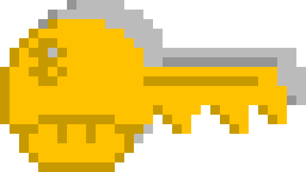
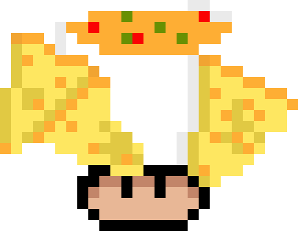
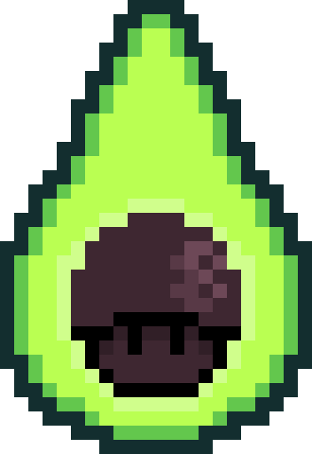
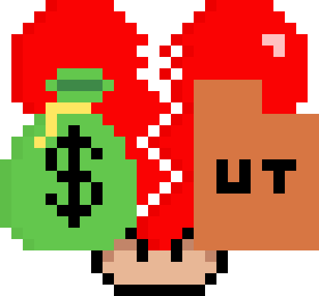
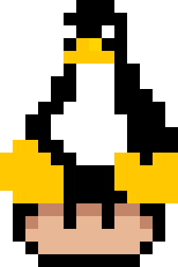
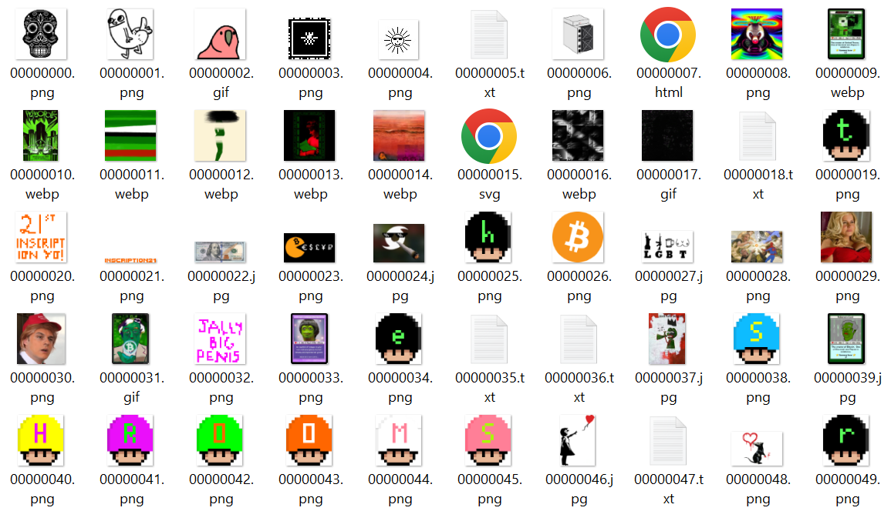

[« Programming (Bitcoin) Ordinals - Step-by-Step Book / Guide](./)


# Sub 1k - Inside The First Thousand Ordinal Inscriptions


Let's explore the first thousand ordinal inscriptions 
from [inscription  №0](https://ordinals.com/inscription/6fb976ab49dcec017f1e201e84395983204ae1a7c2abf7ced0a85d692e442799i0)
to [inscription №999](https://ordinals.com/inscription/48b74ff588de917d4fe4ae2310a7c5c5ec566aece16425d9bc401ed5fd00800ai0).


## Step 0:  Let's build the sub1k (SQL) database (ordlite / sqlite)

Let's setup and build from scratch / zero 
a single-file SQLite database (e.g. `òrdsub1k.db`) with
the first thousand ordinal inscriptions, 
that is, all metadata and (content) blobs, that is, images or text or audio or whatever.

To fetch the inscription metadata and content blobs
let's use the ordinals.com api wrapper / client, that is,
the [ordinals gem](https://github.com/ordbase/ordbase/tree/master/ordinals). 

To setup and build the SQL schema / tables
and insert (& update) all database records let's use
the ordinals sqlite database helpers & machinery, that is, the [ordlite gem](https://github.com/ordbase/ordbase/tree/master/ordlite).


Let's get started:

``` ruby
require 'ordlite'


OrdDb.open( './ordsub1k.db' )

puts
puts "  #{Inscribe.count} inscribe(s)"
puts "  #{Blob.count} blob(s)"
#=>   0 inscribe(s)
#=>   0 blob(s)


## import listed inscripiton ids (fetch via ordinals.com api)
OrdDb.import_csv( "./sub1k_inscriptions.csv" )

puts
puts "  #{Inscribe.count} inscribe(s)"
puts "  #{Blob.count} blob(s)"
#=>   1000 inscribe(s)
#=>   1000 blob(s)
```

Show time! Let's run the [`sub1k_build` script](sub1k_build.rb) and 
once
all 1000×2, that is, 2000 web (api) requests are processed 
you will have a copy of all sub1k ordinal inscriptions with all metadata and content blobs in a single-file SQLite database (about 40 MB).


## Let's query and analyze the sub1k inscriptions via SQL


Let's try a test run ...

``` ruby
require 'ordlite'


OrdDb.open( './ordsub1k.db' )

puts
puts "  #{Inscribe.count} inscribe(s)"
puts "  #{Blob.count} blob(s)"
#=>   1000 inscribe(s)
#=>   1000 blob(s)
```


Let's query for the ten biggest (by bytes) inscriptions 
(and pretty print the result):

```ruby
Inscribe.biggest.limit(10).each do |rec|
    print "#{number_to_human_size(rec.bytes)} (#{rec.bytes} bytes) - "
    print "Inscribe №#{rec.num} (#{rec.content_type}) - "
    print "#{rec.date} - #{rec.fee} fee in sats"
    print "\n"
end
```

or in vanilla SQL:

``` sql
     SELECT * 
      FROM inscribes 
  ORDER BY bytes DESC 
     LIMIT 10
```

resulting in:

```
3.73 MB (3915537 bytes) - Inscribe №652 (image/jpeg) - 2023-02-01 20:38:33 - 0 fee in sats
385 KB (394718 bytes) - Inscribe №978 (application/epub+zip) - 2023-02-02 06:46:04 - 109325 fee in sats
385 KB (394479 bytes) - Inscribe №546 (image/gif) - 2023-02-01 10:41:50 - 1489860 fee in sats
385 KB (394440 bytes) - Inscribe №833 (image/png) - 2023-02-02 01:13:51 - 99314 fee in sats
381 KB (389858 bytes) - Inscribe №388 (image/jpeg) - 2023-01-31 14:01:38 - 981620 fee in sats
379 KB (388417 bytes) - Inscribe №291 (image/gif) - 2023-01-30 17:58:54 - 586794 fee in sats
378 KB (386858 bytes) - Inscribe №857 (image/png) - 2023-02-02 01:17:54 - 97407 fee in sats
374 KB (383322 bytes) - Inscribe №538 (image/jpeg) - 2023-02-01 10:20:28 - 96519 fee in sats
367 KB (375414 bytes) - Inscribe №378 (image/gif) - 2023-01-31 09:47:55 - 945300 fee in sats
365 KB (373504 bytes) - Inscribe №288 (image/jpeg) - 2023-01-30 16:51:46 - 94050 fee in sats
```


Let's query for all inscriptions grouped by date (day) and dump the results:

```ruby
pp Inscribe.counts_by_date   ## or count_by_day
```

or in vanilla SQL:

```sql
 SELECT strftime('%Y-%m-%d', date) AS day, COUNT(*) 
   FROM inscribes 
  GROUP BY day 
  ORDER BY day
```

resulting in:

```
{"2022-12-14" => 1,
 "2022-12-17" => 1,
 "2022-12-19" => 1,
 "2023-01-05" => 1,
 "2023-01-10" => 1,
 "2023-01-12" => 1,
 "2023-01-13" => 2,
 "2023-01-15" => 1,
 "2023-01-16" => 1,
 "2023-01-19" => 5,
 "2023-01-20" => 3,
 "2023-01-21" => 5,
 "2023-01-22" => 34,
 "2023-01-23" => 23,
 "2023-01-24" => 4,
 "2023-01-25" => 9,
 "2023-01-26" => 12,
 "2023-01-27" => 19,
 "2023-01-28" => 16,
 "2023-01-29" => 128,
 "2023-01-30" => 82,
 "2023-01-31" => 98,
 "2023-02-01" => 220,
 "2023-02-02" => 332}
```

Let's query for all inscriptions grouped by month and dump the results:

```ruby
pp Inscribe.counts_by_month
```

or in vanilla SQL:

```sql
 SELECT strftime('%Y-%m', month) AS day, COUNT(*) 
   FROM inscribes 
  GROUP BY month 
  ORDER BY month
```

resulting in:

```
{"2022-12" => 3, 
 "2023-01" => 445, 
 "2023-02" => 552}
```


Let's query for all content types and group by count (descending) and dump the results:


```ruby
pp Inscribe.counts_by_content_type
```

or in vanilla SQL:

```sql
   SELECT content_type, COUNT(*) 
     FROM inscribes 
 GROUP BY content_type
 ORDER BY COUNT(*) DESC, content_type
```

resulting in:

```
{"image/png" => 475,
 "image/jpeg" => 188,
 "image/webp" => 117,
 "text/plain;charset=utf-8" => 112,
 "image/svg+xml" => 62,
 "text/html;charset=utf-8" => 18,
 "image/gif" => 11,
 "audio/mpeg" => 6,
 "application/pdf" => 2,
 "image/avif" => 2,
 "video/webm" => 2,
 "application/epub+zip" => 1,
 "application/pgp-signature" => 1,
 "audio/midi" => 1,
 "audio/mod" => 1,
 "video/mp4" => 1}
```


Let's query for all text inscribes (with content type `text/plain;charset=utf-8`) 
and print out the text:

```ruby
inscribes = Inscribe.text 
puts "  #{inscribes.size} text inscribe(s)"
#=> 112 text inscribe(s)

inscribes.each_with_index do |rec, i|
  puts "==> [#{i+1}/#{inscribes.size}] text inscribe №#{rec.num} (#{rec.content_type} - #{rec.bytes} bytes):"
  puts  rec.text  
  puts
end
```

resulting in:

```
==> [1/112] text inscribe №5 (text/plain;charset=utf-8 - 185 bytes):
Don't think about making art,
just get it done.
Let everyone else decide
if it's good or bad,
whether they love it
or hate it.
While they are deciding,
make even more art.

Andy Warhol

==> [2/112] text inscribe №18 (text/plain;charset=utf-8 - 71 bytes):
bro why the fuck
would i buy an NFT
that’s called a
crypto dickbutt?

==> [3/112] text inscribe №35 (text/plain;charset=utf-8 - 5245 bytes):
                   A Cypherpunk's Manifesto

                        by Eric Hughes

Privacy is necessary for an open society in the electronic age.
Privacy is not secrecy.  A private matter is something one doesn't
want the whole world to know, but a secret matter is something one
doesn't want anybody to know. Privacy is the power to selectively
reveal oneself to the world.

[...]

The Cypherpunks are actively engaged in making the networks safer for
privacy.  Let us proceed together apace.

Onward.

Eric Hughes
<hughes@soda.berkeley.edu>

9 March 1993

-- cut --

==> [6/112] text inscribe №50 (text/plain;charset=utf-8 - 1002 bytes):
"Giving a little more thought to the idea of buying and selling digital cash,
I thought of a way to present it. We're buying and setting 'cryptographic trading cards'.
Fans of cryptography will love these fascinating examples of the cryptographic arts.
Notice the fine way the bit patterns fit together - a mix of one-way functions
and digital signatures, along with random blinding. What a perfect conversation piece
to be treasured and shown to your friends and family.

Plus, your friends will undoubtedly love these cryptographic trading cards just as much.
They'll be eager to trade for them. Collect a whole set!
They come in all kinds of varieties, from the common 1's,
to the rarer 50's, all the way up to the seldom-seen 1000's.
Hours of fun can be had for all..

Your friendly cryptographic trading card dealer wants to join the fun, too.
He'll be as interested in buying your trading cards back as in selling them.

Try this fascinating and timely new hobby today!"

HAL FINNEY, JAN 17 1993

==> [7/112] text inscribe №58 (text/plain;charset=utf-8 - 8 bytes):
satoshi

==> [8/112] text inscribe №59 (text/plain;charset=utf-8 - 10 bytes):
faketoshi

==> [9/112] text inscribe №61 (text/plain;charset=utf-8 - 8 bytes):
bitcoin

==> [10/112] text inscribe №62 (text/plain;charset=utf-8 - 9 bytes):
ordinals

==> [11/112] text inscribe №67 (text/plain;charset=utf-8 - 11 bytes):
21,000,000

==> [12/112] text inscribe №68 (text/plain;charset=utf-8 - 5 bytes):
hodl

==> [13/112] text inscribe №76 (text/plain;charset=utf-8 - 52 bytes):
"Congrats on ordinals, seriously"
- Vitalik Buterin

-- cut --

==> [19/112] text inscribe №97 (text/plain;charset=utf-8 - 4 bytes):
◉

-- cut --

==> [22/112] text inscribe №105 (text/plain;charset=utf-8 - 14492 bytes):
Bitcoin Shrooms impatient for beta release

1 343eec6884a5be860c0c4b73ae978009f6dd96f82882d56b1fd717da59f64f50
2 7fa93ee0c96c70d06ef0321dc1a7f313224b5faf469f74cb23faa18ca49f15ee
3 f822a81a72c5fcd79028dd61f7c8aaf30ddb86b7557df502a498ff857dc19281
4 4575c7015eb5fb7cb9053c850f52efda33da45847ff0441c29d207de834cb67d

5 091a5c36fb5b98c42b364cd44238edd4feff3a8f08aa3548ca190a7665801fb8
6 7a467be1abaa2112222a3325ea7733604edabd53c10c6e914dc936d0c6d6efab
7 8e242644424762774966a18f587d4c7eafcafad258103615e3a66699596c3f56
8 92b6338f6eddd7baa668e5f49bc7dc9e3ac9a040179da943240b029965736925

9 5b53b6dd387f473ff7f83cf075c34aae54c6ef5de372aeeaa0146cc3482a9ee3
10 b420dc8d802428f176c849ee4037952b1b0f30733546f21f2bdc493f170b8b9f
11 205b634a80b6ab3b161fce617fe06906ad0827f95ab3e8f60e22f9d19ac0b834
12 7ccdf1ef1af9afac9e460f457eec362807201aa63a874eb17fc295084a565597

[...]

209 4843cf582cd8d354bee438268aa67f25d3974e63ccf042bf23bc32df6049120e
210 a2c3d36478198914f8e36903bb5a4de7c65e66510a651cfbb0399b7417ac6cb5

-- cut --

==> [24/112] text inscribe №110 (text/plain;charset=utf-8 - 4 bytes):
₿

==> [25/112] text inscribe №111 (text/plain;charset=utf-8 - 3 bytes):
¥

==> [26/112] text inscribe №112 (text/plain;charset=utf-8 - 2 bytes):
$

==> [27/112] text inscribe №113 (text/plain;charset=utf-8 - 4 bytes):
€

-- cut --

==> [42/112] text inscribe №138 (text/plain;charset=utf-8 - 5 bytes):
🙈

==> [43/112] text inscribe №139 (text/plain;charset=utf-8 - 5 bytes):
🙉

==> [44/112] text inscribe №141 (text/plain;charset=utf-8 - 5 bytes):
🙊

-- cut --

==> [47/112] text inscribe №191 (text/plain;charset=utf-8 - 10497 bytes):
BITCOIN ROCKS

100% on-chain rocks. Max supply = 100.

This message is for provenance.

Follow @ordrocks on Twitter for details and updates.

Comprehensive list of Bitcoin rocks & their inscription IDs:

{
{       "rock": "0"     "inscription":  "e8ce0fcb238b377b3a6b9921333e26fbec5c5724c5bf6e783c3dcc1129794508i0",   }
{       "rock": "1"     "inscription":  "87b28e0ccbd2bf4e992674070daa64b8f8546e5c4cb2bf50fe57ac320535d231i0",   }
{       "rock": "2"     "inscription":  "2a83b7d3b3626b671b39be88a6c387080df37ca97d01c401d5475cb21bf0c078i0",   }
[...]
{       "rock": "99"    "inscription":  "b0553e566a5e20246ac2ca464177be6d8bd192eccc300d11fa6a2b6da72aa731i0"    }
}

-- cut --
```

See the complete text log in [sub1k.txt](sub1k.txt). 


Ordinals Triva - Did you know?  [Inscription №824](https://ordinals.com/inscription/f1321b21e8d5605c236600a1a69fbb87343f9e9eb57bf3303fff8bd6f77ca520i0) is a text inscription with 0 bytes (yes, that is, empty) AND it's part
of the "Rare Texts" collection (see [Inscription №891](https://ordinals.com/inscription/6b16c15179a41a94465ed99d787804520c028282332f0f725a1efbfa3195cdf6i0)) 
and titled "Probably Nothing".


For more fun let's query for (basic) game inscriptions 
and save the html (& js) code / text to play in your web browser:


```ruby
## get snake game (no. 142) in "The Basics" series - 
## a basic html & js game collection (no. 1147)
inscribe = Inscribe.find_by( num: 142 )
write_text( "./snake.html", inscribe.text )

## get tetris game (no. 145) in "The Basics" series  
inscribe = Inscribe.find_by( num: 145 )
write_text( "./tetris.html", inscribe.text )
```

Yes, you can. Play the games in your browser:
- [snake.html](https://ordbase.github.io/ordbase/snake.html)  - note: how-to play? length of the snake grows when eating an apple
- [tetris.html](https://ordbase.github.io/ordbase/tetris.html)


Or let's query for the original bitcoin whitepaper (9 pages) 
by Satoshi Nakamoto: 

``` ruby
## get bitcoin whitpaper (no. 54) pdf document
inscribe = Inscribe.find_by( num: 54 )
write_blob( "./bitcoin.pdf", inscribe.content )
```

Yes, you can. Learn more about the beginnings of Bitcoin: A Peer-to-Peer Electronic Cash System:
- [bitcoin.pdf (179 kb)](https://ordbase.github.io/ordbase/bitcoin.pdf)


Ordinals Triva - Did you know?  The Shrooms with 208 out of 210 inscriptions¹ (plus one bonus collection metadata inscription, see [№105](https://ordinals.com/inscription/4e0ad05cbbe3cfdbedec9edb37683a8284bc60ec4ced62272703f182d67e5d70i0)) 
is the biggest sub 1k collection. 

Note 1: Shroom №186 @ [Inscription №1075](https://ordinals.com/inscription/4af5d25017a5c71d1333925ea29b79a18d36548597fc4f03e6a23f2d740547c7i0) and
Shroom №196 @ [Inscription №1074](https://ordinals.com/inscription/2807ac74213d2e9e4b86b7fc121edf7a94c66bc11a8142f851e5d7162d357333i0).


Let's save all shroom .PNGs in the collection for easy access
using `shroom1.png`, `shroom2.png`, `shroom3.png` up to 
`shroom210.png`.  


``` ruby
## read inscription №105 converted "by hand" to .csv datafile
recs = read_csv( './shrooms.csv')  

recs.each do |rec|
   num = rec['num'].to_i(10) 
   hash  = rec['hash']    ## sha256 content hash
   puts "==> saving shroom #{num} with hash #{hash}..."

   ## note: skip shrooms no. 186 & 196 (inscribed as no. 1075 & no. 1074) for now
   next if [186,196].include?(num)  

   blob = Blob.find_by( sha256: hash )
   write_blob( "./i/shroom#{num}.png", blob.content )
end
```

resulting in:

```
==> saving shroom 1 with hash 343eec6884a5be860c0c4b73ae978009f6dd96f82882d56b1fd717da59f64f50...
==> saving shroom 2 with hash 7fa93ee0c96c70d06ef0321dc1a7f313224b5faf469f74cb23faa18ca49f15ee...
==> saving shroom 3 with hash f822a81a72c5fcd79028dd61f7c8aaf30ddb86b7557df502a498ff857dc19281...
==> saving shroom 4 with hash 4575c7015eb5fb7cb9053c850f52efda33da45847ff0441c29d207de834cb67d...
==> saving shroom 5 with hash 091a5c36fb5b98c42b364cd44238edd4feff3a8f08aa3548ca190a7665801fb8...
==> saving shroom 6 with hash 7a467be1abaa2112222a3325ea7733604edabd53c10c6e914dc936d0c6d6efab...
==> saving shroom 7 with hash 8e242644424762774966a18f587d4c7eafcafad258103615e3a66699596c3f56...
==> saving shroom 8 with hash 92b6338f6eddd7baa668e5f49bc7dc9e3ac9a040179da943240b029965736925...
==> saving shroom 9 with hash 5b53b6dd387f473ff7f83cf075c34aae54c6ef5de372aeeaa0146cc3482a9ee3...
==> saving shroom 10 with hash b420dc8d802428f176c849ee4037952b1b0f30733546f21f2bdc493f170b8b9f...
...
```

and








...


To be continued...


## Bonus - Let's export (save as ...) all inscriptions content blobs

Let's export (save as ...) all inscription content blobs
to local files with (mime) content types mapped
to file extensions (e.g. `image/png` to `.png`, `text/plain` to `.txt`, and so on)
and use the the inscription number as its filename 
(for easy sorting padded with eight zeros e.g. `0` to `00000000`, `1` to `00000001`) ...


``` ruby
require 'ordlite'

OrdDb.open( './ordsub1k.db' )

Inscribe.all.each do |rec|
  print "==> exporting inscribe №#{rec.num} "
  print ">#{rec.content_type}< #{number_to_human_size(rec.bytes)} (#{rec.bytes} bytes) " 
  print "to >#{rec.export_path}<..."
  print "\n"
  rec.export   ## gets saved to ./tmp/<num>.<ext> by default
end
```

resulting in:

```
==> exporting inscribe №0 >image/png< 793 Bytes (793 bytes) to >./tmp/00000000.png<...
==> exporting inscribe №1 >image/png< 19.8 KB (20266 bytes) to >./tmp/00000001.png<...
==> exporting inscribe №2 >image/gif< 9.15 KB (9371 bytes) to >./tmp/00000002.gif<...
==> exporting inscribe №3 >image/png< 321 Bytes (321 bytes) to >./tmp/00000003.png<...
==> exporting inscribe №4 >image/png< 208 Bytes (208 bytes) to >./tmp/00000004.png<...
==> exporting inscribe №5 >text/plain;charset=utf-8< 185 Bytes (185 bytes) to >./tmp/00000005.txt<...
==> exporting inscribe №6 >image/png< 5.34 KB (5466 bytes) to >./tmp/00000006.png<...
==> exporting inscribe №7 >text/html;charset=utf-8< 625 Bytes (625 bytes) to >./tmp/00000007.html<...
==> exporting inscribe №8 >image/png< 27.8 KB (28431 bytes) to >./tmp/00000008.png<...
==> exporting inscribe №9 >image/webp< 33.3 KB (34140 bytes) to >./tmp/00000009.webp<...
...
==> exporting inscribe №998 >text/plain;charset=utf-8< 5 Bytes (5 bytes) to >./tmp/00000998.txt<...
==> exporting inscribe №999 >image/png< 39.4 KB (40384 bytes) to >./tmp/00000999.png<...
```


or if you look in your `./tmp` directory (depending on your operating system):




## Frequently Asked Questions (F.A.Q.s) And Answers

Q: What's that vanilla SQL about? How can I use vanilla SQL?

Once you have built the `ordsub1k.db` (SQLite) database (or use / download 
a shared copy) you can query the datbase using SQLite (visual) tools (e.g. [SQLite Studio](https://sqlitestudio.pl)) or the classic (command-line) shell. Example:

```
$ sqlite3 ordsub1k.db
SQLite version 3.42.0
Enter ".help" for usage hints.
sqlite>
```

Let's print out the inscribes table schema:

```
sqlite> .schema inscribes
```

resulting in:

```sql
CREATE TABLE  "inscribes" 
("id" varchar NOT NULL PRIMARY KEY, 
 "num" integer NOT NULL, 
 "bytes" integer NOT NULL, 
 "content_type" varchar NOT NULL, 
 "date" datetime(6) NOT NULL, 
 "sat" integer NOT NULL, 
 "block" integer NOT NULL, 
 "fee" integer NOT NULL, 
 "tx" varchar NOT NULL, 
 "offset" integer NOT NULL, 
 "address" varchar NOT NULL, 
 "output" varchar NOT NULL, 
 "value" integer NOT NULL, 
 "created_at" datetime(6) NOT NULL, 
 "updated_at" datetime(6) NOT NULL);
CREATE UNIQUE INDEX "inscribe_nums" ON "inscribes" ("num");
```

Let's query for the ten biggest inscribes (by bytes):

```
sqlite>     SELECT num, bytes
   ...>       FROM inscribes
   ...>   ORDER BY bytes DESC
   ...>      LIMIT 10;
```

resulting in:

```
652|3915537
978|394718
546|394479
833|394440
388|389858
291|388417
857|386858
538|383322
378|375414
288|373504
```

Let's query for all inscribes grouped by day count:

```
sqlite>  SELECT strftime('%Y-%m-%d', date) AS day, COUNT(*)
   ...>    FROM inscribes
   ...>   GROUP BY day
   ...>   ORDER BY day;
```

resulting in:

```
2022-12-14|1
2022-12-17|1
2022-12-19|1
2023-01-05|1
2023-01-10|1
2023-01-12|1
2023-01-13|2
2023-01-15|1
2023-01-16|1
2023-01-19|5
2023-01-20|3
2023-01-21|5
2023-01-22|34
2023-01-23|23
2023-01-24|4
2023-01-25|9
2023-01-26|12
2023-01-27|19
2023-01-28|16
2023-01-29|128
2023-01-30|82
2023-01-31|98
2023-02-01|220
2023-02-02|332
```


Let's query for all content types and grouped by count (descending):

```
sqlite>    SELECT content_type, COUNT(*)
   ...>      FROM inscribes
   ...>  GROUP BY content_type
   ...>  ORDER BY COUNT(*) DESC, content_type;
```

resulting in:

```
image/png|475
image/jpeg|188
image/webp|117
text/plain;charset=utf-8|112
image/svg+xml|62
text/html;charset=utf-8|18
image/gif|11
audio/mpeg|6
application/pdf|2
image/avif|2
video/webm|2
application/epub+zip|1
application/pgp-signature|1
audio/midi|1
audio/mod|1
video/mp4|1
```

and so on.


## Questions? Comments?

Join us in the [Ordgen / ORC-721 discord (chat server)](https://discord.gg/dDhvHKjm2t). Yes you can.
Your questions and commetary welcome.


Or post them over at the [Help & Support](https://github.com/geraldb/help) page. Thanks.

